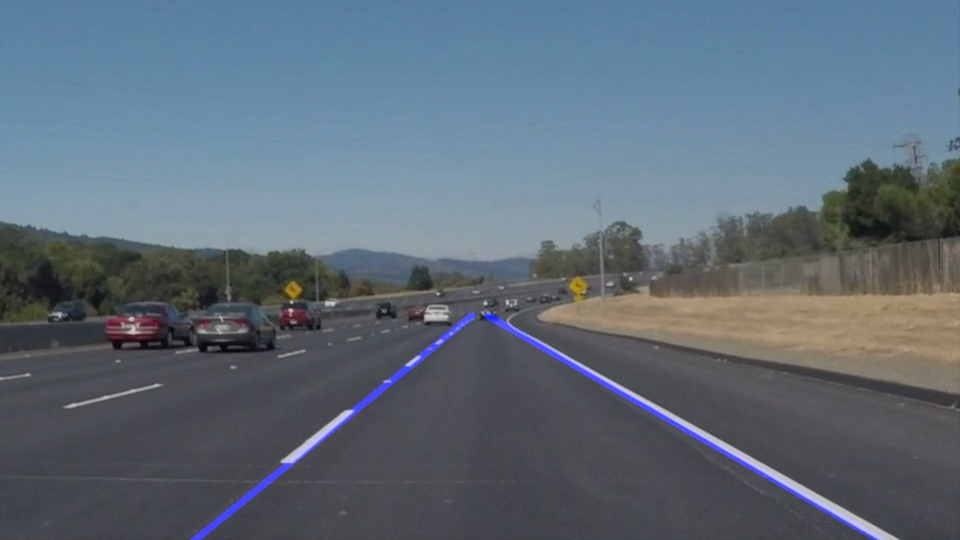

# **Finding Lane Lines on the Road** 

[//]: # (Image References)

---

### Reflection

### 1. Pipeline description

My pipeline consisted of 5 steps. First, I converted the images to grayscale, then I apply a Gaussian
blur to the converted image, followed by a Canny edge detector then masked out only the region we are
interested in. Finally, I used Hough line detection to detect straight lines from the edges detected by
Canny.

In order to draw a single line on the left and right lanes, I modified the draw_lines() function by first
separating the lines with negative and positive slopes to two different sets. Then I calculate the average
slope and bias of each set to get the equation for each line.

### 2. Potential shortcomings

One potential shortcoming would be what would happen when the car is entering a intersection where
there is no clear lane markings.

Another shortcoming could be when the car is in a section of the road where the median is low, this
median will be detected as edge and it will interfere with lane detection.

### 3. Suggest possible improvements to your pipeline

A possible improvement would be to tune the parameters even finer to produce a smoother prediction.

Another potential improvement could be to take into account previous frames prediction instead of
treating each frame independently.
